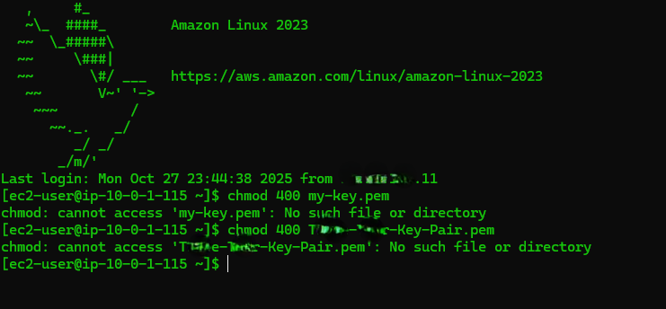

# AWS 3-Tier Architecture

This project demonstrates a simple **2-instance 3-tier architecture** on AWS using a **public NAT instance** and a **private instance** in separate subnets. The setup is designed for learning purposes and documentation.

## Disclaimer

This project is intended **for educational purposes only**. Do not use real IP addresses, security credentials, or key pairs in public repositories. Always follow AWS best practices for security and access control.

---

- **NAT instance**: Public, acts as jump host and outbound gateway for the private instance.
- **Private instance**: Private, no public IP, accessed only through the NAT instance.
- **Key pair**: Shared between both instances (`"<your-key-pair>.pem>"`).

---

## VPC and Subnets

| Component         | CIDR          | Notes                                |
|------------------|---------------|--------------------------------------|
| VPC              | 10.0.0.0/16   | Single VPC for the project           |
| Public Subnet    | 10.0.1.0/24   | NAT instance, auto-assign public IP  |
| Private Subnet   | 10.0.2.0/24   | Private instance, no public IP       |
| Internet Gateway | n/a           | Provides internet access to public subnet |
| Route Tables     | Public → IGW, Private → NAT | Ensures proper routing for connectivity |

---

## Security Groups

## Security Groups (least privilege)
- Bastion SG:
  - Inbound: SSH (22) from your client IP only
  - Outbound: all (default)
- Private/App SG:
  - Inbound: SSH (22) **from Bastion SG** (reference by SG ID)
  - Outbound: all (or restricted to NAT + endpoints)
---

## Key Pair

- **File Name**: `-<your-key-pair>.pem`
- Used for both NAT and private instances
- Stored locally on Windows and copied to NAT for private SSH access

### Copy key to bastion
# On your laptop (Windows PowerShell)
scp -i "C:\Users\<you>\Downloads\<your-key-pair>.pem" `
    "C:\Users\<you>\Downloads\<your-key-pair>.pem" `
    ec2-user@<BASTION_PUBLIC_IP>:~/<your-key-pair>.pem

### SSH to bastion
ssh -i "C:\Users\<you>\Downloads\<your-key-pair>.pem" ec2-user@<BASTION_PUBLIC_IP>

### On the bastion (Linux)
chmod 400 ~/<your-key-pair>.pem
ssh -i ~/<your-key-pair>.pem ec2-user@<PRIVATE_INSTANCE_PRIVATE_IP>

## Optional: Connect with AWS Systems Manager (no SSH, no bastion)
1) Attach IAM role `AmazonSSMManagedInstanceCore` to the instance(s).
2) Ensure outbound HTTPS (443) to SSM endpoints (via NAT Gateway or VPC endpoints).
3) From your laptop (with AWS CLI configured):
aws ssm start-session --target <INSTANCE_ID>

## Notes

The private instance cannot be accessed directly from the internet; all access goes through the NAT instance.

Ping may fail by default due to security groups blocking ICMP — this does not indicate a connectivity issue.

This setup simulates a simplified 3-tier architecture for learning and documentation purposes.

## Instances 📸

## Security Groups 📸

## Pings 📸

## Successful Connection 📸

## ERROR 📸

## Permission Denied 📸 

## Challenges Faced

- Configuring the NAT and private instance correctly with proper subnets and route tables.
- Ensuring SSH access worked through the NAT instance without exposing private instance publicly.
- Managing key pair files on Windows and setting correct permissions for secure SSH.
- Troubleshooting connectivity issues due to incorrect security group rules or IP addresses.

## Lessons Learned

- Understanding the difference between public and private subnets, and why private instances cannot be accessed directly from the internet.
- Importance of using a NAT instance or NAT gateway for outbound internet access from private instances.
- Properly structuring AWS resources for a simple 3-tier architecture.
- Using placeholders for sensitive data when documenting cloud projects publicly.

## 👩🏽‍💻 Author
**Tchai Chambers**  
Cloud & Security Enthusiast | AWS | Azure | Terraform | Cybersecurity  
📫 [LinkedIn](#) | [GitHub](https://github.com/tchaiwanda)

## 🏷️ Tags

`#AWS` `#EC2` `#CloudComputing` `#Networking` `#VPC` `#NAT` `#Subnet` `#SSH` `#Linux` `#Windows` `#3TierArchitecture` `#AWSCloud` `#CloudSecurity` `#AWSNetworking` `#InfrastructureAsCode` `#AWSBeginner` `#LearningProject` `#CloudProject`
